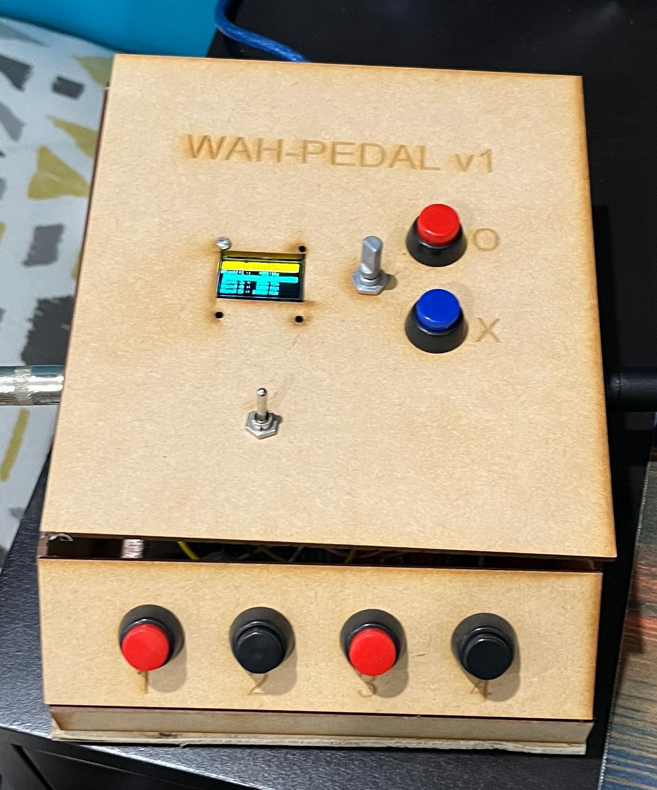
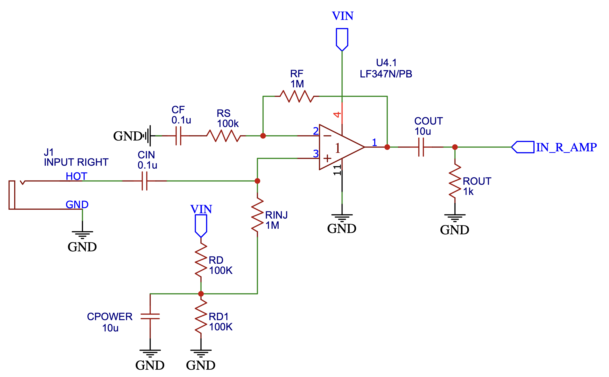
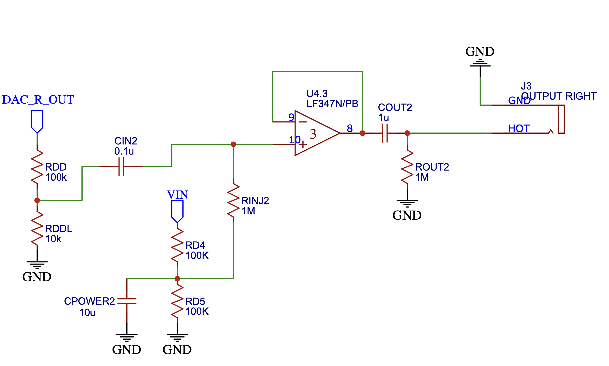
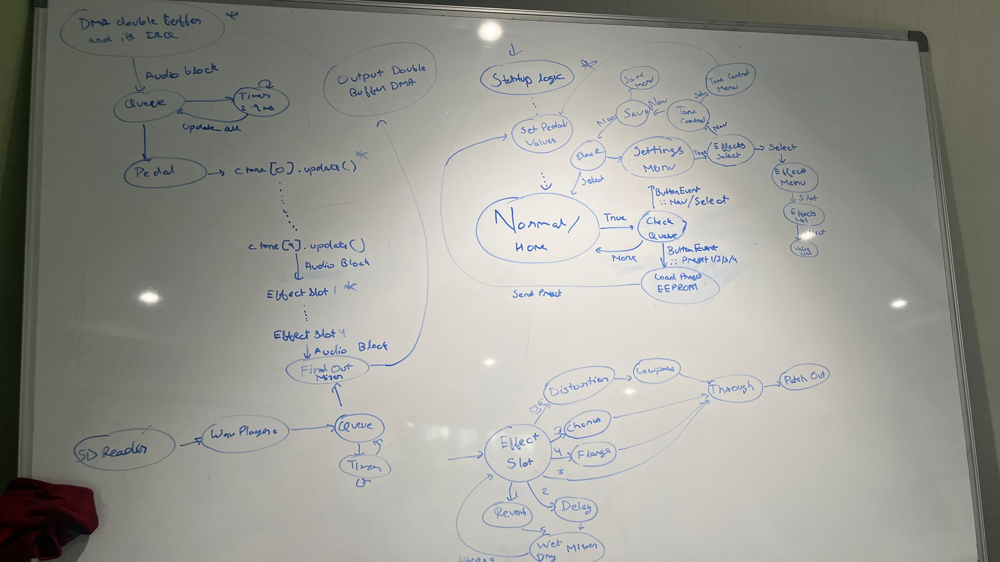

# Teensy Guitar Pedal

A digital multi-effects guitar pedal built on a Teensy 4.1. It processes a guitar signal in real time through a chain of DSP effects, plus tone-shaping EQ, and supports saving/recalling settings as presets — all controlled from an onboard screen, buttons, and a rotary encoder.



This was built as part of the CP3001: Embedded Systems course project.
<!-- See the accompanying project report for more detail on the guitar signal analysis and circuit design decisions behind the pedal. -->

## Hardware

- **Teensy 4.1** (ARM Cortex-M7 @ 600 MHz) — runs the DSP and control logic
- **PCM1808** — 24-bit ADC, converts the guitar's analog signal to digital
- **PCM5102A** — 24-bit DAC, converts the processed digital signal back to analog
- **SSD1306 OLED** (128x64, I2C) — displays menus and settings
- 2 navigation buttons, a rotary encoder (with push button), and 4 preset buttons

### Circuits
A **preamp circuit** is used to boost the instrument-level input and buffer it for the ADC. This is a DC-biased non-inverting amplifier which takes in the ~300 mVpp instrument signal and applies a gain of ~11 to bump it up to the 3.3 Vpp input range of the ADC.  An **output buffer** is used to bring the DAC output back to an instrument level signal with low impedance which goes into an amp. This is a simple voltage divider followed by a buffer / voltage follower circuit.

| Preamp circuit | Output buffer circuit |
| --- | --- |
|  |  |

Full circuit design, PCB layouts, and frequency-response measurements with and without the preamp are in `imgs/`. [This article](https://macalisterelectronics.com/guitar-pickup-equivalent-circuits.html()) on guitar pickup equivalent circuits was great for understanding the signal characteristics we are working with and designing a good preamp circuit to handle the instrument signal for your specific ADC.

## Signal chain

```
Instrument -> Preamp -> ADC -> Teensy -> DAC -> Output buffer -> Amplifier
```

Audio comes in over I2S at 44.1 kHz, passes through a 10-band peaking EQ, then through four effect slots that are each independently set to one of: distortion, reverb, delay, chorus, flange, or bypass. Effect chaining is done using the [Teensy Audio Library](https://www.pjrc.com/teensy/td_libs_Audio.html).

## State machine

Hand-drawn finite state machine covering the UI/UX flow, effect chain, and IO handling:



## Project structure

```
src/        Source files (main loop, pedalboard/effect logic, buttons, screen, settings menu)
include/    Header files
imgs/       Circuit diagrams, PCB designs, frequency response plots, and photos
analysis/   Python scripts and sample audio used for measurements
test/       PlatformIO test files
```

## Building

This is a [PlatformIO](https://platformio.org/) project targeting the `teensy41` board.

```
pio run              # build
pio run -t upload    # build and flash to a connected Teensy 4.1
```

Dependencies (Adafruit SSD1306/GFX/BusIO, Teensy Audio Library) are declared in `platformio.ini` and fetched automatically by PlatformIO.

